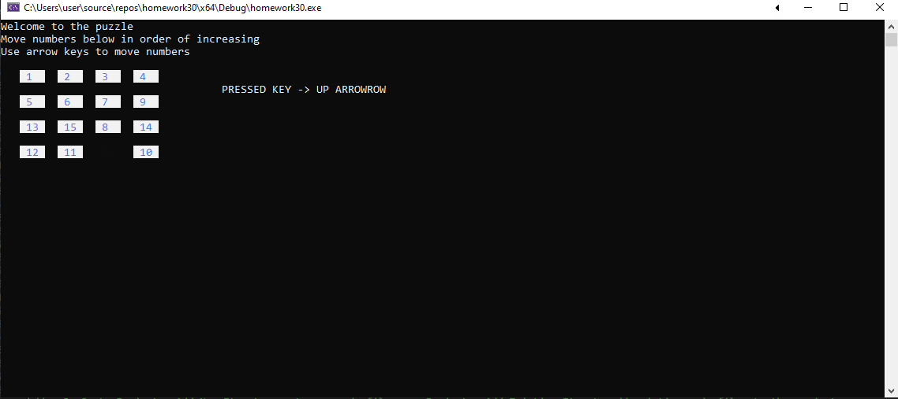
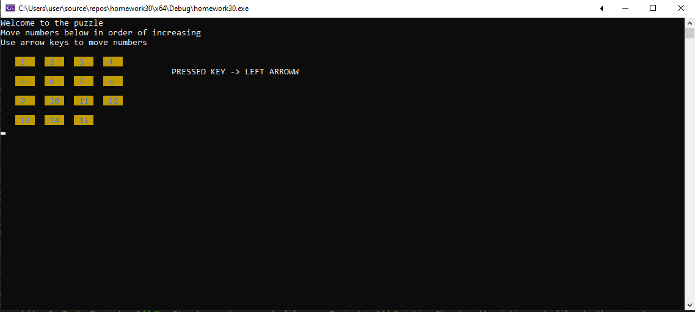

# 15 Puzzle

The 15 Puzzle (also called Gem Puzzle, Boss Puzzle, Game of Fifteen, Mystic Square and many others) is a sliding puzzle which has 15 square tiles numbered 1 to 15 in a frame that is 4 tile positions high and 4 positions wide, with one unoccupied position.
Tiles in the same row or column of the open position can be moved by sliding them horizontally or vertically, respectively. The goal of the puzzle is to place the tiles in numerical order (from left to right, top to bottom).

Screens of Console:  

